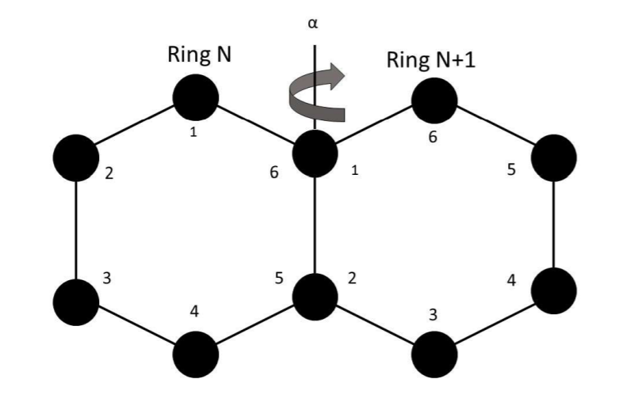

# B.H.Sc-Thesis
During the 2017-18 academic year at McMaster university I completed an undergraduate thesis in the physisc department on a computational statistical physics topic. See MA_THESIS.pdf for the paper submitted. The simulation code was written in c++ using visual studio 2017. I have since updated to include a makefile for compilation from the command line.

## Brief Introduction/Background

The goal of my thesis was to create a statistical physics model for helicene molecules and test its accuracy. Computations in
statistical physics for all but a few edge cases are unfeasible to do analytically by hand as this would require integrating
over an arbitrarily large number of dimensions (each degree of freedom in the model is a dimension to integrate over). Thus,
to get predictions from the model I used a computational method, specifically the Metropolis-Hastings algorithm. 

Monte Carlo simulation is a method of approximating the answer of an integral by randomly sampling points on the domain of 
integration. This base method can be improved upon by exploiting the form of the integrand. The **Metropolis-Hastings 
algorithm** is monte carlo scheme that preferentially samples points that contribute a large amount to the integral, thus 
converging towards the true answer more quickly than an entirely random sampling of the domain. It preferentially selects 
points by comparing the current point to the prospective next point, accepting the next point with probability equal to the 
boltzmann factor between the two points. 

By computing quantities of interest (such as end-to-end distance of the helicene molecule) and storing them each time a point is accepted, the average can be taken after many samples. If the model is accurate, and sufficient samples taken, then these averages should be very close to the true values. 

## Model implementation
##### Description
Use this image as reference for the description below.

  
</ p>

Helicenes are chains of carbon atom rings. As can be seen in the diagram above, the rings 'share' 2 atoms with each adjacent
ring. In my notation atoms 1 & 6 and 2 & 5 are the same atoms between 2 adjacent rings. In the model, the atoms in a ring are
at a fixed distance and angle relative to one another (i.e. the rings are rigid). The model allows the angle between 2
adjacent rings to change (denoted alpha in the diagram).  

This is implemented in the simulation code as a list of angles between rings, a 3d-vector class, and a set of 6 positions
representing the atoms of the initial ring. The list of angles between rings encodes all the information to construct the
chain from an initial ring using vector operations. 

The position of all atoms in the chain can be recursively computed in the following manner

   1.   Any 2 positions in the current ring can be used to compute the vector between them
   2.   Any 2 vectors between points on the ring can be used to produce the normal to the plane of the ring by taking the cross-product
   3.   By rotating the normal by the angle between the current ring and the next ring, you get the normal for the next ring
   4.   Positions 1 and 2 in the next ring are given by positions 6 and 5 respectively in the current ring
   5.   All positions in the next ring can be recursively computed, starting at pos 2, by taking the vector from pos (n-1) to pos n, doubling it, subtracting the vector pos (n-1) to pos (n) and rotating the resulting vector by 60 degrees about the normal

##### Limitations and expansion points
The most obvious point to improve upon is to allow ring torsion (i.e instead of rigid rings, they can twist). Without 
torstion in the model, the model cannot produce helical structures for large numbers of rings (and only approximates it for 
small numbers of rings).  

## A few results

## Link to thesis supervisor
https://www.physics.mcmaster.ca/component/comprofiler/userprofile/shi.html?Itemid=351
